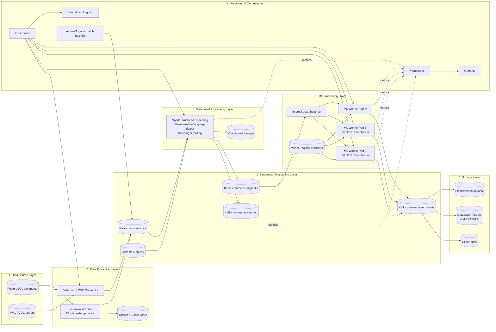

# Distributed Comment ML Pipeline Architecture

## 1) Full System Architecture

## 2) Component Explanations

### Data Source Layer
- Primary OLTP source: `comments` table in PostgreSQL with billions of rows.
- Extraction must avoid full scans via CDC or indexed cursor reads (`id`, `created_at`).

### Data Extraction Layer
- **Primary mode**: CDC using Debezium from PostgreSQL WAL for low-latency, append-like ingestion.
- **Fallback / bootstrap mode**: incremental poller with cursor state in durable store.
- Cursor strategy:
  - `last_created_at`, `last_id` tie-breaker to avoid duplicates and misses.
  - Query pattern uses composite index and bounded batch size.

### Streaming / Messaging Layer (Kafka)
- Topics:
  - `comments.raw` (N partitions, keyed by `comment_id`)
  - `comments.cleaned`
  - `comments.ml_tasks`
  - `comments.ml_results`
- Use compression (`lz4` or `zstd`) and idempotent producers.
- Delivery semantics:
  - At-least-once end-to-end with idempotent sinks.
  - Exactly-once achievable in Kafka+Spark segments with transactions/checkpoints.

### Distributed Processing Layer (Spark Structured Streaming)
- Reads from `comments.raw`.
- Performs validation, normalization, optional language detection enrichment.
- Routes records into model task buckets and emits micro-batches to `comments.ml_tasks`.
- Uses checkpointing and backpressure (maxOffsetsPerTrigger, trigger intervals).

### ML Processing Layer
- Stateless worker pods consume `comments.ml_tasks` in batches.
- Inference services:
  - Sentiment model
  - Toxicity classifier
  - Embedding model
- GPU nodes for embedding-heavy loads; CPU autoscaling for lightweight classifiers.
- Internal HTTP/gRPC API for predict requests from consumers.

### Storage Layer
- `comments.ml_results` sink to:
  - **ClickHouse** for low-latency analytics / dashboards.
  - **Parquet Data Lake** partitioned by processing date and language.
  - Optional Elasticsearch for search.
- Use idempotent upsert key = `comment_id` + model_version.

### Monitoring + Orchestration
- Prometheus metrics from extractor, Kafka, Spark, and ML workers.
- Grafana dashboards for ingestion lag, p95 latency, and throughput.
- Structured logs with trace IDs propagated via Kafka headers.
- Kubernetes HPA + KEDA autoscaling based on Kafka lag / custom metrics.

## 3) Partition & Throughput Strategy

- Kafka partition key: `comment_id` for stable ordering per comment.
- Initial sizing example for 1M comments/min:
  - 192–512 partitions for `comments.raw` depending on broker/node count.
  - Producer batch size tuned (e.g., 256KB–1MB), linger 10–50ms.
- Spark parallelism: at least number of Kafka partitions consumed.
- ML workers:
  - Dynamic batching (e.g., 64–1024 samples) and timeout windows.
  - Separate consumer groups per model family if independent scaling desired.

## 4) Failure Handling

- **Retries**: exponential backoff for DB and Kafka operations.
- **Checkpointing**: Spark checkpoint directory on durable object storage.
- **Replay**: reprocess from Kafka offsets for bug fixes/model upgrades.
- **Backpressure**:
  - Kafka lag-based autoscaling.
  - Spark `maxOffsetsPerTrigger`.
  - ML worker queue length + adaptive batch size.
- **Dead Letter Topic**: malformed payloads to `comments.dlq`.

## 5) Deployment Strategy (Docker + Kubernetes)

- Containerized services:
  - extractor
  - spark job image
  - ml-worker
- Kubernetes components:
  - Deployments for extractor and ML worker
  - Spark Operator or spark-submit on k8s
  - StatefulSets for Kafka/ClickHouse where applicable
- Rollout strategy:
  - blue/green or canary for model/service updates
  - versioned Kafka message schema via Schema Registry

## 6) Scaling to Billions of Comments

- Shard ingestion by time + ID windows for historical backfills.
- Keep hot/cold tiers in storage and compute.
- Apply model routing:
  - lightweight classifiers run always
  - expensive embeddings on sampled/prioritized subsets if cost constrained
- Use compact binary formats (Avro/Protobuf) + compression to reduce network and storage footprint.
- Add regional clusters with async replication for geo-scale.

## 7) Optimization Techniques for Large Text Data

- Normalize text once; cache reusable features.
- Use vectorized tokenization and batched inference.
- Quantized or distilled models for high-QPS endpoints.
- Mixed precision inference on GPU.
- Partition Parquet by `dt`, `language`; cluster by `comment_id` for query pruning.
- Periodic compaction and small-file mitigation in data lake.
